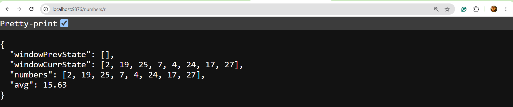

# Average Calculator Microservice

A simple Node.js API that fetches numbers from external sources, keeps the last 10 unique values, and returns their average.

- Start: `node index.js`
- Use:  `GET http://localhost:9876/numbers/:numberid` (where `numberid` is `p`, `f`, `e`, or `r`)

## Screenshots

